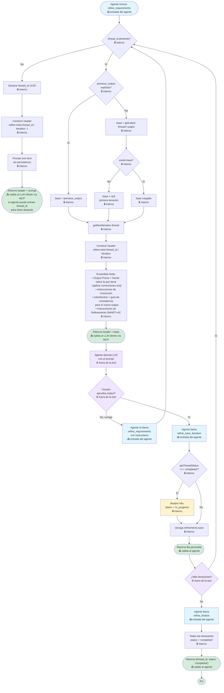

# Refine — Flujo actual y seguimiento

Documento de referencia para el flujo de la skill `refine` y el seguimiento del cambio SDD [`refine-gated-flow`](../../openspec/changes/refine-gated-flow/).

## Flujo actual (pre gated-flow)

Estado del código en [packages/tools/refine/src/index.ts](../tools/refine/src/index.ts). La tool es un **prompt builder + persistencia por hilo**; no razona ni decide cuándo cerrar el refinamiento — eso lo conduce el cliente (CLI / LLM / user).

**Convenciones del diagrama:**
- 📥 **entrada del agente** — el agente invoca la tool
- 📤 **salida al agente** — la tool devuelve un resultado (prompt, fila, error)
- 🔒 **interno** — paso dentro de la tool, sin interacción con el agente
- ⚙️ **fuera de la tool** — decisión o acción del agente/usuario, no de la skill

### Leyenda

- **Azul** — entrada del cliente
- **Verde** — terminales
- **Amarillo** — warning no bloqueante
- **Rojo** — error bloqueante
- **Violeta** — acciones del cliente (fuera de la tool)
- **Blanco** — lógica interna de la tool

## Paso a paso de decisiones

1. **Hilo nuevo o existente** ([index.ts:186](../tools/refine/src/index.ts#L186)) — normaliza `thread_id`/`instructions` (vacíos → `undefined`). Sin `thread_id` ejecuta path one-shot con UUID generado; con `thread_id` entra al path iterativo.
2. **Resolver base** ([index.ts:212-214](../tools/refine/src/index.ts#L212-L214)) — prioridad: `previous_output` explícito → `getLatest(thread)?.output` → `null`.
3. **Próxima iteración** ([index.ts:216](../tools/refine/src/index.ts#L216)) — `getNextIteration(thread)` va al header meta.
4. **Sin warning por finalización** — el hilo con status `'completed'` NO emite banner. El prompt se retorna normalmente; si el agente persiste una nueva iteración, el hilo se reabre automáticamente.
5. **Ensamblado del prompt** ([index.ts:233-267](../tools/refine/src/index.ts#L233-L267)) — secciones condicionales (`Output Previo`, `Instrucciones de Corrección`, `rulesSection`) + bloque fijo `Instrucciones de Refinamiento` (SMART + ambigüedades + información faltante + casos límite + criterios de aceptación). En path iterativo, sin `Requerimientos de Entrada`.
6. **Aprobación del cliente** — el cliente muestra, el LLM ejecuta, el user revisa. La tool no participa de esta decisión.
7. **Persistencia** ([index.ts:384-405](../tools/refine/src/index.ts#L384-L405)) — `refine_save_iteration`; si el hilo está `'completed'`, reabre automáticamente (todas las filas → `'in_progress'`) e inserta la nueva iteración `'in_progress'` en una transacción.
8. **Cerrar** ([index.ts:419-423](../tools/refine/src/index.ts#L419-L423)) — `refine_finalize` marca todas las iteraciones como `'completed'`; idempotente.

## Problemas conocidos del flujo actual

- No hay gating entre "hacer preguntas" y "refinar" — el prompt pide SMART + AC **en la misma respuesta** que las ambigüedades. El LLM puede producir AC sobre preguntas no resueltas.
- El cliente decide por su cuenta si el refinamiento está listo; no hay una señal estructurada de "aún quedan dudas".
- Sin separación de fases, no se puede instrumentar "responder preguntas" como iteración distinta de "re-refinar texto".

## Seguimiento del cambio `refine-flow-refactor`

> El cambio anterior `refine-gated-flow` fue **descartado** sin implementar — ver [archive/refine-gated-flow-DISCARDED-2026-04-21/](../../openspec/changes/archive/refine-gated-flow-DISCARDED-2026-04-21/).

SDD completo: [openspec/changes/refine-flow-refactor/](../../openspec/changes/refine-flow-refactor/) — planning listo, sin tareas ejecutadas.

### Estado por fase

| Fase | Descripción | Estado |
|------|-------------|--------|
| 1 | Storage — tipos, repo, DDL, migración (wipe), tests | ✅ completada |
| 2 | Skill refine — one-shot con UUID, iterativo sin `Requerimientos de Entrada`, save sin throw, finalize sin literal, tests | ✅ completada |
| 3 | CLI — colorización, `iterate` sin UUID local, mensaje de error removido | ✅ completada |
| 4 | Docs y spec base — `mcp-instructions.md`, `refine-flow.md`, `specs/refine/spec.md`, sync MCP | ✅ completada |
| 5 | Verify E2E (S1..S12 del spec) + regression tests | ✅ completada |
| 6 | Cleanup y PR | 🟡 en curso |

Actualizar al avanzar con `/sdd-apply refine-flow-refactor`. Tareas detalladas en [openspec/changes/refine-flow-refactor/tasks.md](../../openspec/changes/refine-flow-refactor/tasks.md).

## Flujo objetivo (post gated-flow)

Placeholder — diagrama a agregar cuando arranque Fase 3 del cambio. Idea:

- `refine_discover` produce prompt de solo preguntas → LLM responde con `[A1] ... [M1] ...`.
- `refine_ingest_questions` parsea y persiste cada pregunta como fila en `refinement_questions`.
- `refine_answer_questions` va respondiendo una por una; `countOpen` decrementa.
- `refine_requirements` consulta `phase` efectiva: sigue en `discovery` mientras queden abiertas; transiciona a `refinement` cuando `countOpen === 0` y emite SMART + AC con `Resolved Context`.
- `refine_finalize` rechaza si queda alguna pregunta abierta (salvo `force_phase='refinement'`).

Ver [openspec/changes/refine-gated-flow/design.md](../../openspec/changes/refine-gated-flow/design.md) para el detalle arquitectónico.
